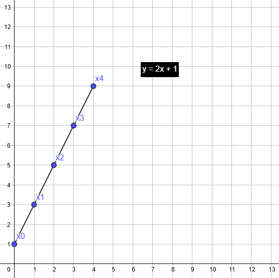
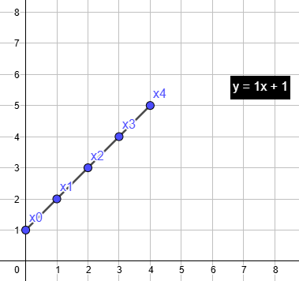
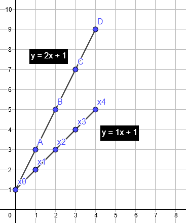
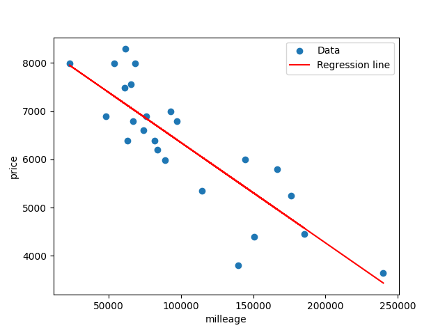

# Linear regression

_Code a program that can predict the price of a car using linear regression with a gradient algorithm_

# Line formula

To create a linear regression, you need to understand how to create a simple equation of a straight line, here the formula of a 2d line
y = mx + b

Let's say that we have the following dataset of int: x = [0, 1, 2, 3], our formula will be y = m0 + b, y = m1 + b, y = m2 + b etc..
But what about the m and b variable ? m correspond to the 'slope' of our line, to simplify, more big is m, more inclined will be our line and the b correspond to the start 
### Example 1 

m (slope) = 2
b = 1

### Example 2

m (slope) = 1
b = 1

### Result

## Sigma (Σ) Notation

Sigma (Σ) is a symbol used to represent the sum of a series of numbers. It's a shorthand notation that allows us to express a summation over a set of values or an array. The general form of Sigma is:

$\left( \sum_{i=1}^{n} x_i \right)$

Where \( x_i \) represents individual values in an array and \( n \) is the total number of elements in that array.

In linear regression, we often deal with sums of values in order to compute the best-fit line. Let’s start with a simple example to understand Sigma well.

We will use the arrays:
X = [1, 2, 3]
Y = [4, 5, 6]

_(ambiguous example without i or n)_

### Example 1

To find the sum of these values, we can apply Sigma as follows:

$\left( \sum_{X} \right) = 1 + 2 + 3 = 6$

### Example 2

You can also apply Sigma to the squared values of an array. If you square each element in the array \( X \) and then sum them, you can write it like this:

$\left( \sum_{X^2} \right) = 1^2 + 2^2 + 3^2 = 1 + 4 + 9 = 14$

### Example 3

Use Sigma with 2 arrays, which result on the multiplication of the X(x) * Y(x)

$\left( \sum_{XY} \right) = 1 * 4 + 2 * 5 + 3 * 6 = 4 + 10 + 18 = 32$

## Linear Regression calculation

So now, we learned about how to draw a line and use Sigma.

For our linear regression, we will use the formula learned earlier 
y = mx + b

Where 
m = (N∑xy - ∑x∑y) / (N∑x² - (∑x)²)
And
b = (∑y - m∑x) / N

For this example, We will use the arrays:
X = [1, 2, 3]
Y = [4, 5, 6]

### Calculation of m

m = (N∑xy - ∑x∑y) / (N∑x² - (∑x)²)

N = number of points, in our case 3.
So let's start the calculation, with the left part:

m = (3∑xy - ∑x∑y) / (3∑x² - (∑x)²)

∑x = 1 + 2 + 3 = 6
∑y = 4 + 5 + 6 = 15
∑xy = 1*4 + 2*5 + 3*6 = 4 + 10 + 18 = 32

m = (3 * 32 - 6 * 15) / (3∑x² - (∑x)²) = (96-90/ (3∑x² - (∑x)²)

Now, continue with the right part

$\left( \sum_{X^2} \right) = 1^2 + 2^2 + 3^2 = 1 + 4 + 9 = 14$

m = (96-90) / (3 * 14 - 6 * 6) = (96-90) / (42 - 36)

The final result is

m = (96-90) / (42 - 36) = 6 / 6
m = 6 / 6 = 1

### Calculation of b

b = (∑y - m∑x) / N

N is still the number of points, so 3, and we already calculated m just before, and we know that m = 1

b = (∑y - ∑x) / 3

b = (15 - 6) / 3 = 9
b = 9 / 3 = 3

The final result is

b = 3

## Project ft_linear_regression

In the school subject, we were given the followings 3 formulas

$\hat{y}^{(i)} = \theta_1 \cdot x + \theta_0$

$\theta_0 = \alpha \cdot \frac{1}{m} \sum_{i=0}^{m-1} \left( \hat{y}^{(i)} - y^{(i)} \right)$

$\theta_1 = \alpha \cdot \frac{1}{m} \sum_{i=0}^{m-1} \left( \hat{y}^{(i)} - y^{(i)} \right) \cdot x^{(i)}$

### The first one
Used to provide a price prediction on a given parameter (milleage)

$\theta_0$ and $\theta_1$ are values previously calculated by their respective formula.
$x$ correspond to the input value (milleage)

### Second one
Is used to train our model and calcul the values for $\theta_0$

$\alpha$ correspond to the 'learning rate' (something like 0.001 or 0.01), the learning rate controls, how big each update step is. A high rate may converge fast but can miss the best result; a low rate is more precise but slower.
$\hat{y}^{(i)}$ correspond to the result of the first formula we saw earlier
$y^{(i)}$ correspond to the real result (the wanted result)

So basically, what the second formula does is compare $\hat{y}^{(i)}$ (the estimate from our AI) with $y^{(i)}$ (the expected result) measure the difference, and calculate an 'error' gap. For example, if $\hat{y}^{(i)}$ returns 15 but $y^{(i)}$ equals 20, we know the error gap is -5. The ai will take this into account and improve in the next iteration.

### Last one
Is used to train our model and calcul the values for $\theta_1$

$\alpha$ correspond to the 'learning rate'
$\hat{y}^{(i)}$ correspond to the result of the first formula we saw earlier
$y^{(i)}$ correspond to the real result
x correspond to the given parameter (milleage)

Pretty similar to the second formula, but for the calucation of $\theta_1$

## Project Result

With the given data.csv, we can run our trainer.py to compute the values of theta0 and theta1. Then, we can run bonus.py to visualize
our dataset along with the regression line. The result is a perfectly aligned straight line through our cloud of points

