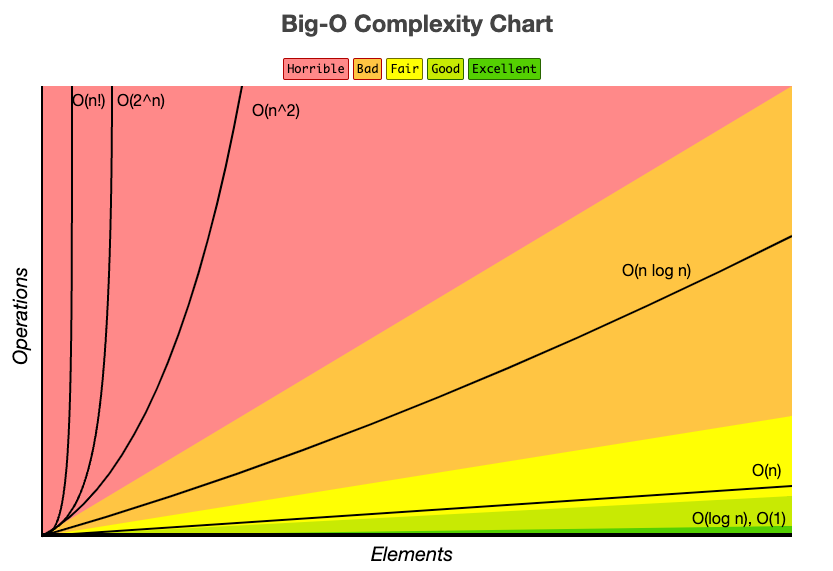

# Big-O Notation

## Definition

Big-O notation is a mathematical way used to describe the time complexity (or space complexity) of an algorithm.
It measures how the running time or memory usage grows as the input size $n$ becomes large.

Instead of exact timings (which depend on hardware, language, or even compiler), Big-O gives an upper bound, it tells us
the worst-case growth rate of the algorithm.

In other words, Big-O ignores machine details and constant factors, focusing only on how fast the algorithm scales as the input grows.

## Formula 

## General notes

## Example