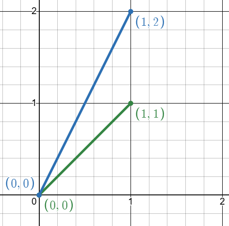
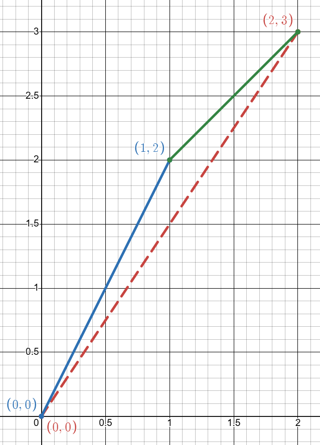
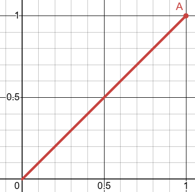
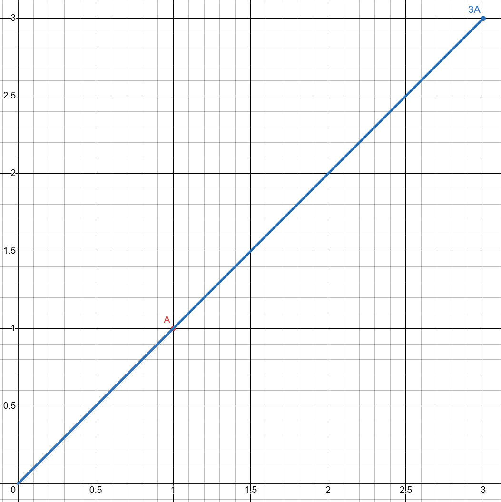
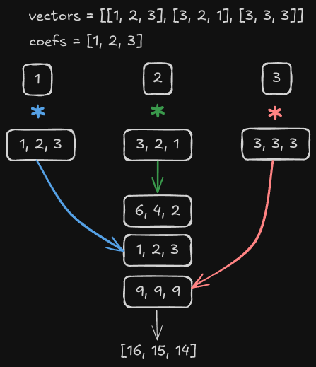

# Vector

## Definition

A vector in linear algebra context, is an object that contains multiple values (also called components). These values can represent
many things, but they are most commonly used to describe quantities that have both magnitude (size) and direction.

## General notes

Vectors are not limited to just two dimensions:

In 3D space, a vector has three components (x, y, z).

In general, a vector can have any number of components (v1, v2, ..., $v^n$).

In linear algebra, a vector is an element of a vector space. It can be represented as a one-dimensional array of numbers (its components) relative to a chosen basis.

This makes vectors useful for geometry physics, computer graphics, machine learning, and more, since they can describe directions,
forces, velocities, colors, or even abstract data.

## Addition and scalar 

The simplest example of a vector is in the 2D coordinate system. Here, a vector has two components:

$\vec{v}$ = (x, y)

The first value x represents the horizontal component, and the second value y represents the vertical component.

So, if you imagine a point in the plane at coordinates (x, y), the vector can be drawn as an arrow starting from the origin
(0, 0) and pointing to (x, y).

### Addition

Let's say that we have these two vectors with x, y points: A = [1, 1], B = [1, 2]

To add two vectors, we add their **corresponding components**:

$C = A + B = [A_x + B_x, \ A_y + B_y]$

Plugging in the numbers:

$C = [1 + 1, \ 1 + 2] = [2, 3]$

Which result by a new vector C = [2, 3]

The addition of two vectors creates a new vector. To add two vectors, both must have the same dimension, which means you 
cannot add a vector A = [x, y, z] with B = [x, y] because they do not have the same number of components.

### Scalar multiplication

Let's say that we have the vector A with x, y points: A = [1, 1]

We can choose a scalar S = 3, and compute the scalar multiplication with the vector A

$SA = S ⋅ A = [S ⋅ A_x, \ S ⋅ A_y]$

Plugging in the numbers:

$SA = S ⋅ A =  [3 ⋅ 1, \ 3 ⋅ 1] = [3, 3]$

Which result by a new vector AS (A3) = [3, 3]

## Linear combination

A linear combination is a fundamental concept too when working with for vectors.
Simply put, we take a list of vectors and a list of coefficients (scalars).
Each scalar is multiplied by its corresponding vector, and then all the resulsts are added together.

⚠️ Both the vector list and the coefficient list must have the **same size**.

### Example

Let's take  

vectors = [[1, 2, 3], [3, 2, 1], [3, 3, 3]]

coefs = [1, 2, 3]

Firstly, multiply each vector by its corresponding coefficient

1 * [1, 2, 3] = [1, 2, 3]

2 * [3, 2, 1] = [6, 4, 2]

3 * [3, 3, 3] = [9, 9, 9]

Then, add the results component-wise

1 + 6 + 9 = 16 
2 + 4 + 9 = 15
3 + 2 + 9 = 14

Final vector: [16, 15, 14]

