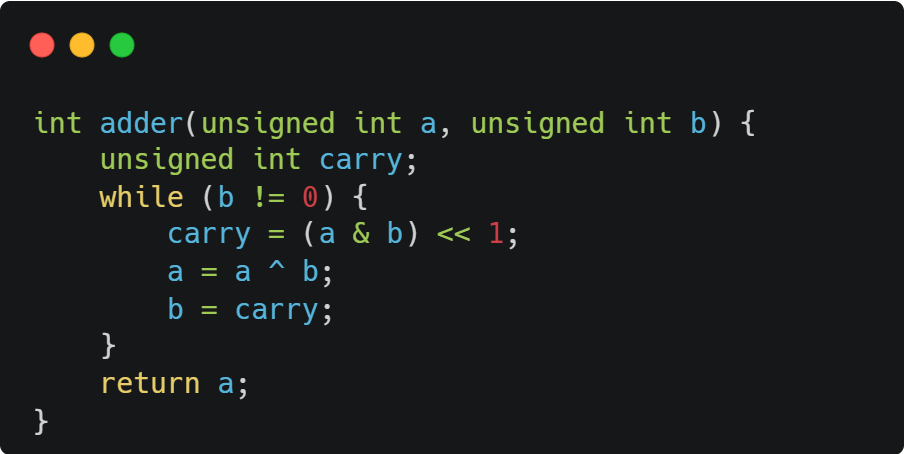
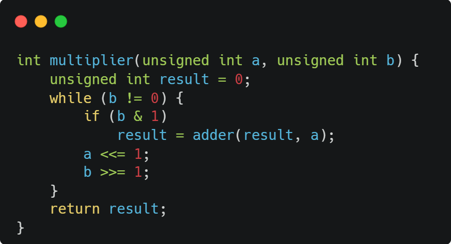

# Ready set bool

_Computer-related mathematics with Boolean Algebra and Sets Theory_

## ex00 and ex01 (bitwise)

For this two exercices, we have to implement the operator + (addition) and * (multiplication) (with positif numbers) using bitwise operator, in this case, ^ and <<.

### Addition

Doing binary addition is very easy and similar to decimal addition. It basically works the same way
0 and 1 = 1
1 and 0 = 1
0 and 0 = 0
1 + 1 = 0 (with a carry of 1) → which becomes 10 in binary

This is why we use:
^ (XOR) to compute the sum without carry
& << 1 to compute the carry bits
We repeat until there are no more carry bits left.

Let's say that we have 5 (0101) and 10 (1010). The expected result is 15 (1111).

5 = 0101
10 = 1010
-> First line we have 0 (for 5) and 1 (for 10) = 1 
-> Second line 1 and 0 = 1
-> Thrid line 0 and 1 = 1
-> Last line 1 and 0 = 1

### Multiplication

Binary multiplicatoin works just like decimal multiplication:

- Go through each digit (bit) of the multiplier (b)
- If the bit is 1, you add the current value of a (shited to the left)
- You shift a left (a <<= 1) every time, like moving to the next column in decimal
- You shift b right (b >>= 1) to check the next bit

## ex02 (graycode)

Gray code is a type of binary encoding with a simple but powerful rule: only one bit changesat a time when incrementing by one unit.
This can be very useful in many contexts, as it helps avoid  'transitional states' that occur in standard cinary encoding.

For example, in standard binary encoding, when incrementing from 1 to 2:
0001 (1)
0000 (?) -> Set the 1 to 0 (transition)
0010 (2) -> End by setting a 1 to create the number 2

This intermediate state (0000) doesn't represent either value and may result in undefined behavior, which can be problematic or even damaging in certain context and critical apps.

